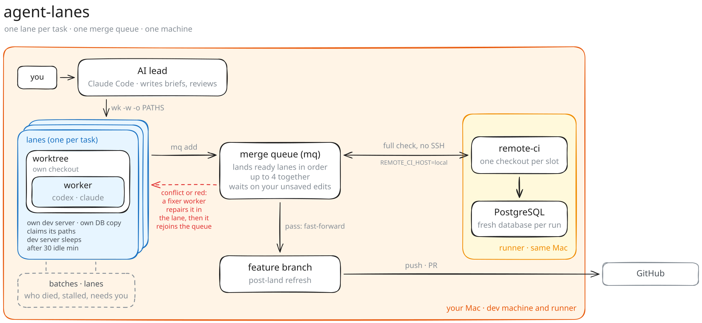
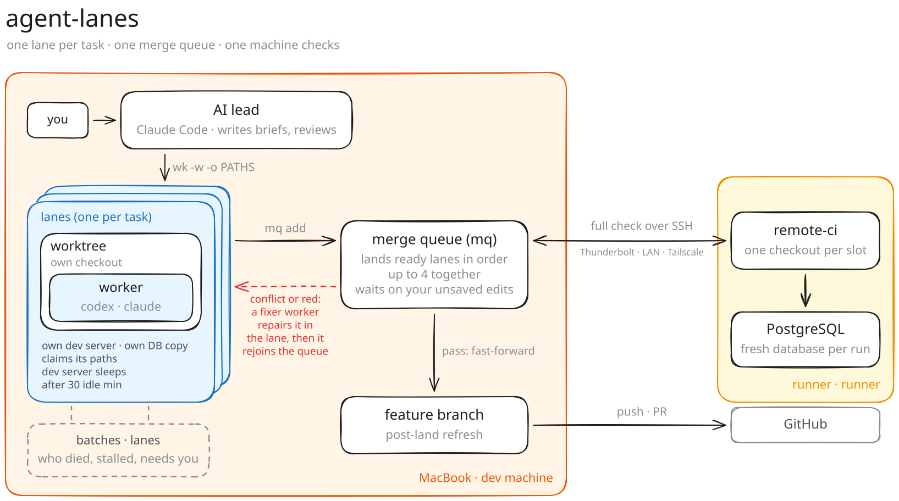

# agent-lanes

Small shell tools for running **many AI coding agents in parallel on one repository** without them tripping over each other. One human decides, one AI lead plans and reviews, and many workers build in their own *lanes*.

Built for [Claude Code](https://docs.anthropic.com/en/docs/claude-code) as the lead, on macOS. Workers run on the [Codex CLI](https://github.com/openai/codex) by default, or on the Cursor CLI, opencode, pi or oh-my-pi (see [Supported harnesses](#supported-harnesses)). Lanes work with any git repository; per-lane dev servers and database copies know common web stacks (see [Supported stacks](#supported-stacks)). Each tool is a few hundred lines of shell, Python or JavaScript, so it's easy to read and adapt.

## The problem

Getting agents to write code is the easy part. With many parallel workers, the slow and fragile part is **landing their work**:

- Batches edit the same hot files, so merges conflict.
- A "merge train" that checks several batches together fails as a whole when one of them is bad.
- Workers that share a working tree or a database change each other's state.
- Pages that should look alike drift apart when one is copied from the other.

## How it works

<a href="docs/standalone-light.webp">
<picture>
  <source media="(prefers-color-scheme: dark)" srcset="docs/standalone-dark.svg">
  
</picture>
</a>

<sub>Click the diagram to open it full size (zoom in, or press Raw for the original; also in <a href="docs/standalone-dark.webp">dark</a>).</sub>

1. **You talk to the lead.** The AI lead (Claude Code) splits the work into briefs and starts one lane per task with `wk`.
2. **Each lane is isolated.** It gets its own git worktree (a separate checkout where its worker commits), its own dev server and its own copy of the local database. It claims the paths it will edit; a new lane whose claim overlaps a live one is refused, and the queue flags changes outside a lane's claim.
3. **Workers commit in their lane.** You and the lead look at the diff and screenshots; risky work gets a read-only reviewer.
4. **The merge queue lands finished lanes.** `mq` rebases a train of up to 4 ready lanes onto the branch tip and runs one full check for all of them. A pass fast-forwards the branch.
5. **Failures go back, not to you.** A conflict or a red check returns to that lane's worker with the error. When it is fixed, the lane rejoins the queue. After two failed fixes it waits for you.
6. **Checks run on a runner.** That is this machine ([standalone](#standalone-setup-one-machine)) or a second one ([example](#example-setup-a-macbook-and-a-mac-mini)). Each run gets its own checkout and, if you use PostgreSQL, a fresh database, so checks never touch your dev data.

`batches` and `lanes` show at any moment which workers died or stalled and which lane needs you.

## The ideas

| Idea | Tool | What it does |
|---|---|---|
| **Lanes (path claims)** | `wk -o` | A build worker claims the paths it will edit. A launch that overlaps another live lane's claim or changes is refused: join that lane or wait. The claim ends when the lane lands. |
| **One writer per lane** | `wk -d` | Workers commit their own work inside their worktree, so a second writing worker in the same tree is refused. Read-only reviewers can join any lane. |
| **Merge queue** | `mq` | Lands ready lanes in **trains of up to 4** (`MQ_TRAIN`): rebase onto the tip → preflight → one full check for the train → fast-forward. A conflict bounces only the conflicting lane. When a train's check is red, the failure is matched to the lane whose files it names; the other lanes land first and the suspect is checked alone (no clear suspect: one lane at a time). A failure goes back to the lane's worker with the error, and the queue moves on. After two failed fix attempts a lane is parked for the lead. The landed tip is exactly the commit that passed the check (in a train, the check runs on the train's tip). |
| **Own dev server and database per lane** | `wt-dev` | A git worktree with its own port and a copy of the local database (`createdb` + dump/restore; seconds for a small dev database), dropped on removal. Dev servers idle for 30 minutes are put to sleep when a new lane starts (or with `wt-dev sleep-idle`), and at most half the CPUs set up new lanes at once. |
| **Checks on a runner** | `remote-ci` | Full test suites run in their own checkout with a fresh database per run: on a second machine, so the dev machine stays responsive, or on the same machine (`REMOTE_CI_HOST=local`). Red runs give a short redacted failure summary that the queue passes to the fixer. |
| **One attention view** | `lanes`, `batches` | One line per lane: worker state, queue state, dev server, uncommitted files. What needs you comes first. `batches` also shows why a worker died. |
| **Disk guard** | `diskguard` | Warns on low disk space, pauses workers below 5 GB and resumes the ones it paused at 7 GB. `wk` refuses new launches below 15 GB. |
| **Model presets** | `ao-model`, `presets/models.conf` | Tools ask for a role (`build`, `build-hard`, `review`), never a model. When a new model ships you change one line. |
| **Review depth by risk** | worker header template | Independent review for high-risk work (money, permissions, migrations, server actions) and shared UI; automated checks for the rest. |
| **Measure, then change one thing** | `session-stats`, `loop-stats` | Time, tokens, check and land outcomes from Claude Code transcripts; per day, worker time by bucket, queue wait, bounce rate and rework per feature. Workflow reviews compare numbers. |

More detail and the reasoning: [docs/concepts.md](docs/concepts.md).

## How-to guide

### 1. Prerequisites

- macOS with `git` and `python3`, plus your project's own toolchain (Node, Python, Ruby, ...).
- Optional, for a dev server per lane: a framework `wt-dev` knows, or a dev command in `.wt-dev.conf` (see [Supported stacks](#supported-stacks)). Without one, lanes still get their own worktree, just no server.
- [Claude Code](https://docs.anthropic.com/en/docs/claude-code) for the lead, and a logged-in worker CLI: the [Codex CLI](https://github.com/openai/codex) by default, or one of the [supported harnesses](#supported-harnesses).
- Optional, for a database copy per lane: a `DATABASE_URL` on `localhost` in the repo's root `.env` and that database's client tools (PostgreSQL: `psql`, `createdb`, `pg_dump`, `pg_restore`; MySQL/MariaDB: `mysql`, `mysqldump`; SQLite: nothing). Without a `DATABASE_URL`, lanes have no database; a remote one stays shared.
- For screenshots (`ui-shots`, `wt-compare`): Playwright installed in the project.
- For the check runner: Homebrew on Apple Silicon (it installs PostgreSQL for test databases when you ask for one). The runner is this machine ([Standalone setup](#standalone-setup-one-machine)) or a second Mac you can SSH into ([Example setup](#example-setup-a-macbook-and-a-mac-mini)).

### 2. Install

```sh
git clone https://github.com/<you>/agent-lanes && cd agent-lanes && ./install.sh
```

This links the tools into `~/.local/bin` and the skills into `~/.claude/skills` (change with `BIN_DIR` / `SKILLS_DIR`). It also creates `~/.config/agent-lanes/config` and `~/.config/agent-lanes/models.conf` from the examples. Edit those for your machine; they are never committed. Re-running is safe.

Check it: `ao-model ls` prints the model presets, and `batches` runs without errors (empty at first).

### 3. Set up a project

Inside your repository:

1. **Worker header** (rules every build worker gets; read-only reviewers get a short built-in one): `mkdir -p ~/.claude/state/headers`, then copy [templates/worker-header.example.md](templates/worker-header.example.md) to `~/.claude/state/headers/<repo-folder-name>.md` and adapt it: risk tiers, which tests to run, report format. `wk` fills in `{{DIR}}`, `{{URL}}`, `{{BASE}}`, `{{NAME}}`, `{{LOGDIR}}` and `{{GIT}}`.
2. **Full check** that `land` and `mq` run before merging, one of:
   - a runner, on this machine (`REMOTE_CI_HOST=local`, see [Standalone setup](#standalone-setup-one-machine)) or a second one: `remote-ci init` (adds `.remote-ci.conf` and a pre-push hook), edit the check command in `.remote-ci.conf`, **commit it** (lanes are made from the branch, so they need it), then `remote-ci setup`;
   - your own `check:remote` script in `package.json` (it gets `--summary <sha>` as arguments);
   - no runner: `export LAND_CHECK="pnpm test"` (any command; it runs in the lane's worktree with your shell's environment, without failure summaries for the queue).
3. **Optional:** an executable `tools/land-preflight.sh` (`chmod +x`) in the repo for cheap checks (format, lint, size limits) that run before the full check, and `tools/post-land.sh OLD_SHA NEW_SHA` for work after each landing in the main checkout (e.g. install dependencies when the lockfile changed).
4. **Tell the lead.** Add a line to the project's `CLAUDE.md` or `AGENTS.md`: "Delegate bounded tasks with `wk` (see the agent-workers skill); land with `mq`."

### 4. Run a lane

Write a brief (`brief.md`): the task, the files involved, how to check it and what "done" means. Then:

```sh
wk invoice-fix -w -o "apps/web/invoice" -m build-hard -t invoice:new -f brief.md
```

- `-w` creates the worktree `invoice-fix` with its own dev server and database copy (`wt-dev ls` shows the port).
- `-o` claims the paths the worker will edit. A later lane that overlaps them is refused; give that task to the lane's worker after it finishes (`wk NAME -r -` with the new task on stdin), or wait until the lane lands.
- `-t invoice:new` tags the launch with a feature and a reason (`new`, `rework`, `bounce`, `review`, `review-fix`, `other`) so rework per feature can be counted.
- `-m` picks a preset (`ao-model ls`). Reviewers use a read-only preset and can join any lane: `wk invoice-review -d invoice-fix -m review -t invoice:review -f review.md`.

Then follow it:

```sh
batches                       # running/failed workers of the last 24 h, and this repo's lanes (--all: also finished)
batches wait invoice-fix      # blocks until it finishes (run it in the background)
batches report invoice-fix    # the worker's short final report
```

Workers commit their own work inside the lane with `wtcommit`. Look at the diff (`git -C "$(wt-dev path invoice-fix)" log -p`) and screenshots before landing.

### 5. Land with the merge queue

```sh
mq add invoice-fix settings-page   # queue finished lanes (they must have no uncommitted work)
mq run                             # only if no runner is up (mq add starts one)
mq ls                              # queue, claims, bounced lanes and their workers
```

`mq` lands ready lanes in trains of up to 4 (`MQ_TRAIN=1` for one at a time): rebase, preflight, one full check, fast-forward, then removes each worktree, its dev server and its database copy. A red train lands the lanes the failure does not point at first, then checks the suspect alone. A conflict or red check goes back to the lane's worker with the error, and the lane rejoins the queue when the worker finishes with everything committed (uncommitted leftovers park it). After two failed fixes the lane is parked for you (`mq drop NAME` to remove it from the queue). `mq add` starts a runner when none is running; an atomic lock refuses concurrent runners and allows takeover of a dead runner’s lock. If you edit files in the main checkout yourself, a lane that changes the same files waits (`mq waiting` names it) until you commit.

```sh
lanes                              # one line per lane; what needs you first
```

### 6. Pause, resume and usage limits

```sh
batches pause            # stop running workers (or name them)
batches pause --stalled NAME  # also allow stopping a STALLED worker
batches resume           # continue them where they stopped
codex-limit              # Codex plan usage and reset time
codex-watch 95 &         # pause running workers automatically at 95% usage
```

`wk` refuses new Codex launches when usage reaches `WK_MAX_PCT` (default 100); other harnesses are not checked. Expired usage windows count as 0%; unknown usage allows a launch. A worker cut off by a provider error continues with `wk NAME -r`.

### 7. Change models

Presets are the only place model names live. `ao-model ls` shows them; override a role in `~/.config/agent-lanes/models.conf`, e.g. `build  <new-model>  medium  full-access  codex`. The [model-presets skill](skills/model-presets/SKILL.md) describes how to try a new model before switching.

### 8. When something goes wrong

| Symptom | What to do |
|---|---|
| `wk: … claimed by …` | Another lane owns those paths. Give the task to that lane's worker when it finishes (`wk NAME -r -`), or wait for it to land. `WK_FORCE=1` overrides. |
| A worker shows `DIED` in `batches` | `batches report NAME`, then `wk NAME -r` to continue or `batches ack NAME` to hide it. |
| A worker shows `STALLED` | Its log has been quiet for a while but the process lives. Check `batches report NAME`; stop it with `batches pause --stalled NAME` before `wk NAME -r`. `batches ack NAME` hides it from the default listing while leaving the process alive. |
| `mq` says `PARKED` | Read `mq ls` and the lane's last report; fix it in the worktree, `wtcommit`, then `mq add NAME` again. |
| `remote-ci` exits 3 | The runner is unreachable. `remote-ci info` still shows configured direct/alias and SSH routes; check the cable, network or VPN and `~/.config/agent-lanes/config`. `land` and `mq` treat this as a failed check; only the pre-push hook falls back to a local run. |
| `wt-dev new` stops with a database error | The copy of the local database failed (missing client tools, a failed create or dump/restore, different table counts, or a database without a built-in adapter: set `WT_DEV_DB_CLONE`/`WT_DEV_DB_DROP`), so the new worktree was removed. Fix the cause, or rerun with `--shared-db` to use the main database on purpose. No `DATABASE_URL` means no database; a remote one stays shared with a warning. |

## Supported harnesses

A worker harness is the agent CLI that runs a worker. Pick it per preset with an optional 6th column in `models.conf` (`codex` when absent). Non-Codex harnesses run through `harness_run.py`, which writes the same log shape as Codex (header, `tokens used`, final report; a last `ERROR:` line on failure, or `stopped by signal N` after `batches pause`). So `batches`, `wk -r`, `batches pause` and `mq` work the same for every harness.

| Harness | CLI | read-only | workspace-write | full-access | Resume | Status |
|---|---|---|---|---|---|---|
| `codex` (default) | Codex CLI | native sandbox | native sandbox | `danger-full-access` | `codex exec resume` | tested daily |
| `pi` | [pi](https://github.com/earendil-works/pi) | tools `read,grep,find,ls` only (no shell) | refused (no sandbox) | all tools | `--session-id` | tested live |
| `opencode` | [opencode](https://opencode.ai) | injected agent: read tools, shell only for `git diff/log/show/status` | refused (no sandbox) | `--auto` | `--session` | tested live |
| `cursor` | Cursor CLI (`cursor-agent`) | `--mode ask` | `--sandbox enabled` | `--sandbox disabled` | `create-chat` + `--resume` | stub-tested only |
| `omp` | [oh-my-pi](https://github.com/can1357/oh-my-pi) | refused (not yet tested) | refused (no sandbox) | `--approval-mode=yolo` | `--resume` | stub-tested only |

"Refused" means a preset that asks for that sandbox fails at launch with a clear message; it never runs with more access than asked. The pi and opencode read-only modes were probed by hand against the live CLIs (pi 0.85, opencode 1.18) with prompts that try to write a file every way they can (file tools, shell chains, redirects, `git diff --output`, `git difftool`, opencode `task` subagents); none wrote. The repo tests check the flags and config, not the enforcement. A pi reviewer has no shell, so give it file paths to read rather than asking for `git diff`. Stub-tested harnesses pass the fake-CLI tests in `tests/test_harness.py` but have not run a live worker yet. The `codex-limit` usage guard applies to Codex presets only.

## Supported stacks

Lanes, claims, the merge queue and the check runner work with any git repository and any test command. Only `wt-dev`'s per-lane dev server, install and database copy need to know your stack. It detects them; an optional `.wt-dev.conf` in the repo overrides anything ([template](skills/wt-dev/templates/wt-dev.conf)).

**Dev servers.** `wt-dev` looks in `apps/web`, `web` and the root (or `--app`), sets `PORT`, and calls the server ready when the port listens.

| Stack | Command `wt-dev` runs | Status |
|---|---|---|
| Next.js | `next dev -p $PORT` | Tested (daily use) |
| Vite (React, Vue, Svelte, Solid, vanilla) | `vite --port $PORT --strictPort` | Tested (a fresh `create vite` app) |
| Django | `manage.py runserver 127.0.0.1:$PORT` | Tested (a fresh `startproject` app with uv) |
| Nuxt, SvelteKit, Astro, Angular | `nuxi dev` / `vite dev` / `astro dev` / `ng serve` with the port | Preset, not yet tested |
| Rails, Laravel, Phoenix | `bin/rails server -p` / `php artisan serve --port` / `mix phx.server` | Preset, not yet tested |
| Anything else: Express, Fastify, NestJS, FastAPI, Flask, Go, Rust... | `WT_DEV_CMD` in `.wt-dev.conf` (read `PORT`) | Works with any command that listens on `PORT` |

`LAND_BASELINE_CMD` in the main checkout's `.wt-dev.conf` (a lane's copy is ignored) opts into a command that `land` runs in the lane on the stack tip. `LAND_BASELINE_FILES` lists space-separated paths to commit with `chore(tooling): update baseline`. Changes to other tracked files fail. An unset command skips the step; these settings alone leave framework detection active.

`.wt-dev.conf` (like `.remote-ci.conf`) is committed shell code that unattended `mq` and `land` run, so it needs the same trust as the repo code.

**Installs** follow the lockfiles at the root: pnpm, npm, yarn, bun, uv, poetry, bundler, composer and mix (or `WT_DEV_INSTALL`). `land` reinstalls only when a lockfile changed.

**Databases.** A database on `localhost` in `.env` gets a copy per lane; the lane's `.env` points at it, and removing the lane drops it.

| Database | How a lane gets its copy | Status |
|---|---|---|
| PostgreSQL | `createdb` + `pg_dump \| pg_restore`, table counts compared | Tested (daily use) |
| MySQL / MariaDB | `CREATE DATABASE` + `mysqldump \| mysql`, table counts compared | Tested on MySQL 8.4; MariaDB not yet |
| SQLite | file copy (a relative path into the worktree, an absolute one next to the original) | Tested |
| Anything else (MongoDB, SQL Server, a Docker service...) | your `WT_DEV_DB_CLONE` / `WT_DEV_DB_DROP` commands | Tested with a sample hook; the template has a MongoDB example |

The check runner's own database is PostgreSQL (`REMOTE_CI_POSTGRES`). For other databases, start one in `REMOTE_CI_PREPARE` or let the tests use SQLite. Linux support is planned. Pull requests for more presets or adapters are welcome, especially with a smoke test.

## Standalone setup: one machine

No second machine? The runner can live on your dev machine. `remote-ci` then skips SSH and runs the same runner scripts locally: each check gets its own checkout under `~/ci`, a fresh database (with `REMOTE_CI_POSTGRES`), a cached pass for code that already passed, and a short failure summary that the merge queue passes to the fixer.

```sh
# ~/.config/agent-lanes/config
REMOTE_CI_HOST=local
```

Then once per project, as in step 3:

```sh
remote-ci init      # adds .remote-ci.conf and a pre-push hook; set REMOTE_CI_CHECK, commit the file
remote-ci setup     # creates ~/ci, and with REMOTE_CI_POSTGRES=<major> its own PostgreSQL on port 5400+major
remote-ci check --summary
remote-ci info      # route=local
```

- The runner's PostgreSQL uses its own port (5418 for version 18), so it does not collide with a dev database on 5432. It runs only during checks.
- The run starts with a clean environment: the lane's `DATABASE_URL`, `NODE_ENV` and `PATH` do not reach it.
- Checks share the CPU with your dev servers and workers. They run at `nice 10`; keep `REMOTE_CI_SLOTS=1` and cap test workers (e.g. `export VITEST_MAX_WORKERS=4` in `.remote-ci.conf`). With many lanes, `wt-dev sleep-idle` stops idle dev servers, and `diskguard install` adds a 60-second free-space check.
- Lighter option: `LAND_CHECK="pnpm test"` runs the check in the lane's worktree with the environment of the shell that runs `mq`. It needs no setup, but the tests reach whatever database that environment (or the lane's `.env`, if your test command loads it) points at, and the queue gets no failure summary, so a red train lands one lane at a time. The check must not edit tracked files or commit: `land` refuses to land a tree other than the one it checked.
- Moving to a second machine later is one line: set `REMOTE_CI_HOST` to its SSH host and run `remote-ci setup` again.

## Example setup: a MacBook and a Mac mini

One developer works on a MacBook. A Mac mini on the same desk is the **runner**: it does nothing but full checks, so the laptop stays fast while many workers and dev servers run.

<a href="docs/pipeline-light.webp">
<picture>
  <source media="(prefers-color-scheme: dark)" srcset="docs/pipeline-dark.svg">
  
</picture>
</a>

<sub>Click the diagram to open it full size (zoom in, or press Raw for the original; also in <a href="docs/pipeline-dark.webp">dark</a>). Source: <code>docs/pipeline.excalidraw</code> (edit at excalidraw.com); re-render with <code>node docs/render-diagram.mjs</code>.</sub>

**Connecting the two machines.** `remote-ci` first tries the direct route, then the SSH host, then gives up with exit code 3.

- **Thunderbolt bridge** (fastest; one cable): on both Macs, System Settings → Network → Thunderbolt Bridge. By default `remote-ci` uses the bridge's router address, so no address is needed.
- **Local network or Tailscale** (when the cable is unplugged or you're away from the desk): add the Mac mini as an SSH host and point `remote-ci` at it.

```sh
# ~/.ssh/config on the MacBook
Host mac-mini
  HostName mac-mini.local            # same Wi-Fi / LAN (Bonjour name)
# HostName mac-mini.<tailnet>.ts.net # or its Tailscale MagicDNS name, from anywhere
  User you
  IdentityFile ~/.ssh/id_ed25519

# ~/.config/agent-lanes/config
REMOTE_CI_HOST=mac-mini              # fallback route; the Thunderbolt bridge is tried first
```

Then once per project: `remote-ci init` (adds `.remote-ci.conf` and a pre-push hook) and `remote-ci setup` (prepares the Mac mini). `remote-ci info` prints the selected route, or the configured routes and `unreachable` with exit 3.

**A morning with this setup.** You ask the lead to fix an invoice total bug and redesign the settings page.

1. The lead writes two briefs and starts two lanes. `invoice-fix` claims `apps/web/invoice`, `settings-page` claims `apps/web/settings`. Each gets its own worktree, dev server and copy of the local database, so neither worker sees the other's test data.
2. A third task touching `apps/web/invoice` is refused by `wk` ("claimed by invoice-fix"). The lead adds it to the invoice brief instead of starting a lane that would conflict.
3. Both workers commit in their worktrees and report. Invoice money math is high risk, so a read-only reviewer checks that diff; the settings page gets screenshots at desktop and phone width.
4. `mq add invoice-fix settings-page && mq run`. The queue rebases `invoice-fix` onto the branch, sends it to the Mac mini for the full suite, and fast-forwards on a pass. The laptop keeps serving both dev servers meanwhile.
5. `settings-page` now conflicts with a shared component the invoice lane touched. `mq` sends the conflict back to the settings worker, which rebases and commits; the queue retries it and it lands. `mq ls` shows that state at any moment.
6. Landing removes each worktree, drops its database copy and releases its claim.

## Tools

| Tool | Purpose |
|---|---|
| `wk` | Launch a worker in one line: preset (model and harness), worktree, path claim, the repo's standing header |
| `mq` | Merge queue over `land` |
| `batches` | Worker status: running, died, stalled; lanes with work to land; `batches pause` / `batches resume` |
| `diskguard` | Warn on low disk space; pause workers below 5 GB and resume its own workers at 7 GB; optional 60-second LaunchAgent |
| `lanes` | One line per lane (worker, worktree, queue entry): what needs you first, then what is in progress; read-only |
| `loop-stats` | Per-day worker time by bucket, queue wait, land time, bounce and rework rates, with a 7-day trend |
| `wt-dev`, `land`, `wtcommit`, `migcheck`, `devrestart` | Worktrees with their own dev server and database (idle ones sleep); land lanes; commit by explicit paths |
| `remote-ci` | Full checks on a runner (a second machine or this one), with slots, caches, a fresh database per run, failure summaries and `blame` |
| `ao-model` | Model presets lookup and launch checks |
| `ui-audit`, `ui-shots`, `pw-run`, `wt-compare` | Mechanical UI checks, role-based screenshots (one shared login per role), before/after review pages |
| `ui-quick` (skill) | Fast 1:1 UI polishing with the owner watching the live page: no worktree or workers; lanes that need those edits wait in the queue |
| `discuss` (skill) | Discussion mode: talk through ideas and plans with no edits, workers or commits until you say to start; wraps up into a notes file |
| `session-stats` | Workflow metrics from Claude Code transcripts |
| `ctrash` | Move files to a dated trash folder instead of `rm` (safe for unattended agents) |

Project-specific pieces stay in each project: the worker header (`~/.claude/state/headers/<repo>.md`; see [templates/](templates/)), an optional `tools/land-preflight.sh`, and `.remote-ci.conf`.

## Claude Code mods

Two optional [Claude Code](https://docs.claude.com/en/docs/claude-code) plugins in [mods/](mods/). They load in every session.

**`workers`**: a band above the prompt with context use, running workers per repo and failed workers with where they came from:

```
☀ Clear 5% of context 52.2k / 1.0M   last turns ▁▃▅ ▲ +52.2k   ⚙ 7 running (my-app, api-server) · 1 stalled (my-app worktree search-fix) · 1 errored (api-server worktree auth-retry)   5h 4%  [-]
```

`/workers` opens the full `batches` list in a side pane. When a worker that this session launched finishes or fails, the mod sends this session a prompt, so the lead acts without polling:

```
[workers mod, automatic] Your workers changed state:
- search-fix finished: read `batches report search-fix`, verify, continue.
- auth-retry ERRORED (stream disconnected): find the cause (log tail, batches report), fix the brief or the tool, resume or relaunch.
```

**`guards`**: blocks risky commands before they run and says what to do instead: `rm` (use `ctrash`), `pkill`/`killall`, AI attribution trailers in commits, subagents without a model tag in their description, and subagents on models you list. Force pushes and pushes to `main`/`staging` stop with an **Allow once** button in `/guards`:

```
Guards
  push to main
  git push origin main
  [ Allow once ]
```

Install (user scope, all projects):

```sh
claude plugin marketplace add <path-to-this-repo>
claude plugin install workers@agent-lanes --scope user
claude plugin install guards@agent-lanes --scope user
```

Settings go in `~/.config/agent-lanes/config`: `GUARDS_BLOCK_SUBAGENT_MODELS=<regex>` lists subagent models to block (case-insensitive, e.g. `opus|sonnet`). Unset, no model is blocked; the choice is yours. Edit a mod in `mods/`, then run `/reload-plugins`. Check with `claude plugin validate mods/<mod>` and `claude plugin test mods/<mod>`.

## Status

Current version: see [VERSION](VERSION); every release is tagged `vX.Y.Z` and listed in [CHANGELOG.md](CHANGELOG.md). Extracted from daily use. Expect sharp edges: macOS-first (the remote-ci runner is an Apple Silicon Mac: your own or a second one, such as a Mac mini). Tests cover `session-stats`, `loop-stats`, `lanes`, `diskguard`, the runner's failure diagnostics and the screenshot login cache (`test_browser_tools.mjs` needs a project with Playwright); `wk` harness adapters have fake-CLI tests (`tests/test_harness.py`); the rest of `mq` and `wk` is tested by daily use. `codex-limit` ships as a usage guard: `wk` refuses new Codex launches at `WK_MAX_PCT` (default 100). Issues and small pull requests are welcome; see [CONTRIBUTING.md](CONTRIBUTING.md).

## License

MIT
