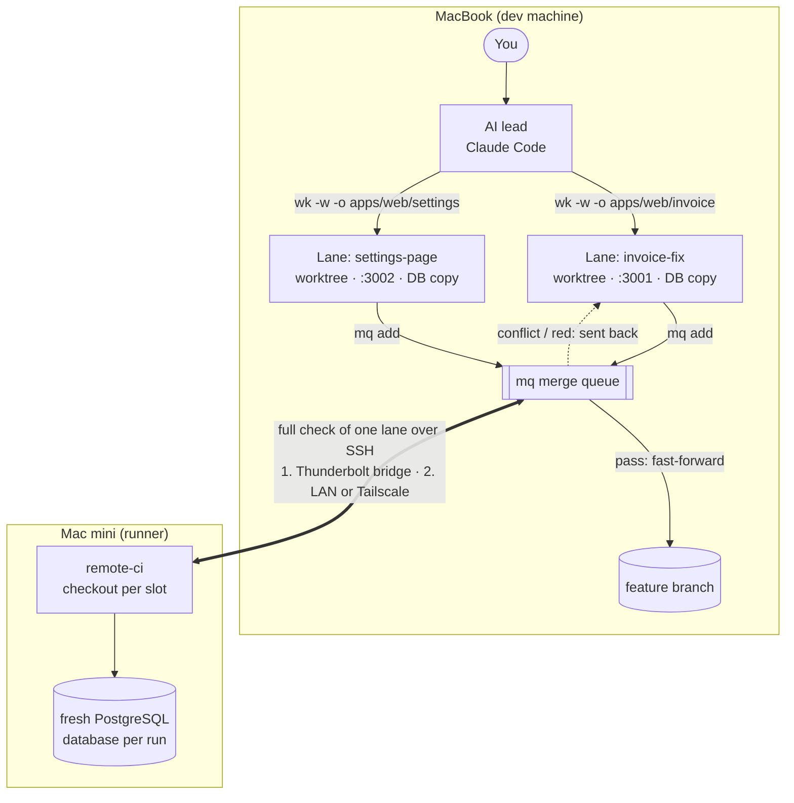

# agent-lanes

Small shell tools for running **many AI coding agents in parallel on one repository** without them tripping over each other. One human decides, one AI lead plans and reviews, and many workers build in their own *lanes*.

Built for [Claude Code](https://docs.anthropic.com/en/docs/claude-code) as the lead and the [Codex CLI](https://github.com/openai/codex) for workers, on macOS, in Node/pnpm projects (some tools assume Next.js and PostgreSQL). Each tool is a few hundred lines of shell or JavaScript, so it's easy to read and adapt.

## The problem

Getting agents to write code is the easy part. With many parallel workers, the slow and fragile part is **landing their work**:

- Batches edit the same hot files, so merges conflict.
- A "merge train" that checks several batches together fails as a whole when one of them is bad.
- Workers that share a working tree or a database change each other's state.
- Pages that should look alike drift apart when one is copied from the other.

## The ideas

| Idea | Tool | What it does |
|---|---|---|
| **Lanes (path claims)** | `wk -o` | A build worker claims the paths it will edit. A launch that overlaps another live lane's claim or changes is refused: join that lane or wait. The claim ends when the lane lands. |
| **One writer per lane** | `wk -d` | Workers commit their own work inside their worktree, so a second writing worker in the same tree is refused. Read-only reviewers can join any lane. |
| **Merge queue** | `mq` | Lands lanes **one at a time**: rebase onto the tip → preflight → one full check → fast-forward. A conflict or red check goes back to the lane's worker with the error, and the queue moves on. After two failed fix attempts a lane is parked for the lead. Every landed commit is exactly the one that passed. |
| **Own dev server and database per lane** | `wt-dev` | A git worktree with its own port and a copy of the local database (`createdb` + dump/restore; seconds for a small dev database), dropped on removal. |
| **Heavy checks elsewhere** | `remote-ci` | Full test suites run on a second machine with a fresh database per run, so the dev machine stays responsive. |
| **Model presets** | `ao-model`, `presets/models.conf` | Tools ask for a role (`build`, `build-hard`, `review`), never a model. When a new model ships you change one line. |
| **Review depth by risk** | worker header template | Independent review for high-risk work (money, permissions, migrations, server actions) and shared UI; automated checks for the rest. |
| **Measure, then change one thing** | `session-stats` | Time, tokens, check and land outcomes from Claude Code transcripts, so workflow reviews compare numbers. |

More detail and the reasoning: [docs/concepts.md](docs/concepts.md).

## How-to guide

### 1. Prerequisites

- macOS with `git`, Node.js with `pnpm`, and `python3`.
- A Next.js app in the repo (`apps/web`, `web` or the root; `--app` for another folder) for `wt-dev`'s per-lane dev server. The app's `.env` is loaded through the project's `dotenv` CLI (`dotenv-cli` as a dev dependency), which is also what points a lane at its own database.
- [Claude Code](https://docs.anthropic.com/en/docs/claude-code) for the lead and the [Codex CLI](https://github.com/openai/codex), logged in, for workers.
- For a database copy per lane: a local PostgreSQL with `psql`, `createdb`, `pg_dump` and `pg_restore` on your PATH, and a `DATABASE_URL` on `localhost` in the repo's root `.env`. Without them, lanes share the database and `wt-dev new` reports why the copy was skipped.
- For screenshots (`ui-shots`, `wt-compare`): Playwright installed in the project.
- Optional: a second Apple Silicon Mac with Homebrew that you can SSH into, as the check runner (see [Example setup](#example-setup-a-macbook-and-a-mac-mini)).

### 2. Install

```sh
git clone https://github.com/<you>/agent-lanes && cd agent-lanes && ./install.sh
```

This links the tools into `~/.local/bin` and the skills into `~/.claude/skills` (change with `BIN_DIR` / `SKILLS_DIR`). It also creates `~/.config/agent-lanes/config` and `~/.config/agent-lanes/models.conf` from the examples. Edit those for your machine; they are never committed. Re-running is safe.

Check it: `ao-model ls` prints the model presets, and `batches` runs without errors (empty at first).

### 3. Set up a project

Inside your repository:

1. **Worker header** (rules every build worker gets; read-only reviewers get a short built-in one): `mkdir -p ~/.claude/state/headers`, then copy [templates/worker-header.example.md](templates/worker-header.example.md) to `~/.claude/state/headers/<repo-folder-name>.md` and adapt it: risk tiers, which tests to run, report format. `wk` fills in `{{DIR}}`, `{{URL}}`, `{{BASE}}`, `{{NAME}}`, `{{LOGDIR}}` and `{{GIT}}`.
2. **Full check** that `land` and `mq` run before merging, one of:
   - a runner machine: `remote-ci init` (adds `.remote-ci.conf` and a pre-push hook), edit the check command in `.remote-ci.conf`, **commit it** (lanes are made from the branch, so they need it), then `remote-ci setup`;
   - your own `check:remote` script in `package.json` (it gets `--summary <sha>` as arguments);
   - no runner: `export LAND_CHECK="pnpm test"` (any command; it runs in the lane's worktree).
3. **Optional:** an executable `tools/land-preflight.sh` (`chmod +x`) in the repo for cheap checks (format, lint, size limits) that run before the full check.
4. **Tell the lead.** Add a line to the project's `CLAUDE.md` or `AGENTS.md`: "Delegate bounded tasks with `wk` (see the agent-workers skill); land with `mq`."

### 4. Run a lane

Write a brief (`brief.md`): the task, the files involved, how to check it and what "done" means. Then:

```sh
wk invoice-fix -w -o "apps/web/invoice" -m build-hard -f brief.md
```

- `-w` creates the worktree `invoice-fix` with its own dev server and database copy (`wt-dev ls` shows the port).
- `-o` claims the paths the worker will edit. A later lane that overlaps them is refused; give that task to the lane's worker after it finishes (`wk NAME -r -` with the new task on stdin), or wait until the lane lands.
- `-m` picks a preset (`ao-model ls`). Reviewers use a read-only preset and can join any lane: `wk invoice-review -d invoice-fix -m review -f review.md`.

Then follow it:

```sh
batches                       # running/failed workers of the last 24 h, and this repo's lanes (--all: also finished)
batches wait invoice-fix      # blocks until it finishes (run it in the background)
batches report invoice-fix    # the worker's short final report
```

Workers commit their own work inside the lane with `wtcommit`. Look at the diff (`git -C "$(wt-dev path invoice-fix)" log -p`) and screenshots before landing.

### 5. Land with the merge queue

```sh
mq add invoice-fix settings-page   # queue finished lanes (they must have no uncommitted work)
mq run                             # one runner per repo; run it in the background
mq ls                              # queue, claims, bounced lanes and their workers
```

`mq` lands one lane at a time: rebase, preflight, full check, fast-forward, then removes the worktree, its dev server and its database copy. A conflict or red check goes back to the lane's worker with the error, and the lane rejoins the queue when the worker finishes with everything committed (uncommitted leftovers park it). After two failed fixes the lane is parked for you (`mq drop NAME` to remove it from the queue). Start `mq run` once; an atomic lock refuses concurrent runners and allows takeover of a dead runner’s lock.

### 6. Pause, resume and usage limits

```sh
batches pause            # stop running workers (or name them)
batches pause --stalled NAME  # also allow stopping a STALLED worker
batches resume           # continue them where they stopped
codex-limit              # Codex plan usage and reset time
codex-watch 95 &         # pause running workers automatically at 95% usage
```

`wk` refuses new launches when usage reaches `WK_MAX_PCT` (default 100). Expired usage windows count as 0%; unknown usage allows a launch. A worker cut off by a provider error continues with `wk NAME -r`.

### 7. Change models

Presets are the only place model names live. `ao-model ls` shows them; override a role in `~/.config/agent-lanes/models.conf`, e.g. `build  <new-model>  medium  full-access  codex`. The [model-presets skill](skills/model-presets/SKILL.md) describes how to try a new model before switching.

### 8. When something goes wrong

| Symptom | What to do |
|---|---|
| `wk: … claimed by …` | Another lane owns those paths. Give the task to that lane's worker when it finishes (`wk NAME -r -`), or wait for it to land. `WK_FORCE=1` overrides. |
| A worker shows `DIED` in `batches` | `batches report NAME`, then `wk NAME -r` to continue or `batches ack NAME` to hide it. |
| A worker shows `STALLED` | Its log has been quiet for a while but the process lives. Check `batches report NAME`; stop it with `batches pause --stalled NAME` before `wk NAME -r`. `batches ack NAME` hides it from the default listing while leaving the process alive. |
| `mq` says `PARKED` | Read `mq ls` and the lane's last report; fix it in the worktree, `wtcommit`, then `mq add NAME` again. |
| `remote-ci` exits 3 | The runner is unreachable. `remote-ci info` still shows configured direct/alias and SSH routes; check the cable, network or VPN and `~/.config/agent-lanes/config`. `land` and `mq` treat this as a failed check; only the pre-push hook falls back to a local run. |
| `wt-dev: own database not created…` | The lane uses the shared database. The message gives the reason: missing `DATABASE_URL` in `.env`, a URL away from localhost, missing Postgres tools, `createdb` failure, dump/restore failure or unverifiable/different table counts. |

## Example setup: a MacBook and a Mac mini

One developer works on a MacBook. A Mac mini on the same desk is the **runner**: it does nothing but full checks, so the laptop stays fast while many workers and dev servers run.



**Connecting the two machines.** `remote-ci` first tries the direct route, then the SSH host, then gives up with exit code 3.

- **Thunderbolt bridge** (fastest; one cable): on both Macs, System Settings → Network → Thunderbolt Bridge. By default `remote-ci` uses the bridge's router address, so no address is needed.
- **Local network or Tailscale** (when the cable is unplugged or you're away from the desk): add the Mac mini as an SSH host and point `remote-ci` at it.

```sh
# ~/.ssh/config on the MacBook
Host mac-mini
  HostName mac-mini.local            # same Wi-Fi / LAN (Bonjour name)
# HostName mac-mini.<tailnet>.ts.net # or its Tailscale MagicDNS name, from anywhere
  User you
  IdentityFile ~/.ssh/id_ed25519

# ~/.config/agent-lanes/config
REMOTE_CI_HOST=mac-mini              # fallback route; the Thunderbolt bridge is tried first
```

Then once per project: `remote-ci init` (adds `.remote-ci.conf` and a pre-push hook) and `remote-ci setup` (prepares the Mac mini). `remote-ci info` prints the selected route, or the configured routes and `unreachable` with exit 3.

**A morning with this setup.** You ask the lead to fix an invoice total bug and redesign the settings page.

1. The lead writes two briefs and starts two lanes. `invoice-fix` claims `apps/web/invoice`, `settings-page` claims `apps/web/settings`. Each gets its own worktree, dev server and copy of the local database, so neither worker sees the other's test data.
2. A third task touching `apps/web/invoice` is refused by `wk` ("claimed by invoice-fix"). The lead adds it to the invoice brief instead of starting a lane that would conflict.
3. Both workers commit in their worktrees and report. Invoice money math is high risk, so a read-only reviewer checks that diff; the settings page gets screenshots at desktop and phone width.
4. `mq add invoice-fix settings-page && mq run`. The queue rebases `invoice-fix` onto the branch, sends it to the Mac mini for the full suite, and fast-forwards on a pass. The laptop keeps serving both dev servers meanwhile.
5. `settings-page` now conflicts with a shared component the invoice lane touched. `mq` sends the conflict back to the settings worker, which rebases and commits; the queue retries it and it lands. `mq ls` shows that state at any moment.
6. Landing removes each worktree, drops its database copy and releases its claim.

## Tools

| Tool | Purpose |
|---|---|
| `wk` | Launch a Codex worker in one line: preset, worktree, path claim, the repo's standing header |
| `mq` | Merge queue over `land` |
| `batches` | Worker status: running, died, stalled; lanes with work to land; `batches pause` / `batches resume` |
| `wt-dev`, `land`, `wtcommit`, `migcheck`, `devrestart` | Worktrees with their own dev server and database; land one lane; commit by explicit paths |
| `remote-ci` | Full checks on a runner machine, with slots, caches and a fresh database per run |
| `ao-model` | Model presets lookup and launch checks |
| `ui-audit`, `ui-shots`, `pw-run`, `wt-compare` | Mechanical UI checks, role-based screenshots, before/after review pages |
| `session-stats` | Workflow metrics from Claude Code transcripts |
| `ctrash` | Move files to a dated trash folder instead of `rm` (safe for unattended agents) |

Project-specific pieces stay in each project: the worker header (`~/.claude/state/headers/<repo>.md`; see [templates/](templates/)), an optional `tools/land-preflight.sh`, and `.remote-ci.conf`.

## Status

Extracted from daily use. Expect sharp edges: macOS-first (the remote-ci runner is currently an Apple Silicon Mac, such as a Mac mini), and few tests beyond `session-stats`. `codex-limit` ships as a usage guard: `wk` refuses new launches at `WK_MAX_PCT` (default 100). Issues and small pull requests are welcome; see [CONTRIBUTING.md](CONTRIBUTING.md).

## License

MIT
